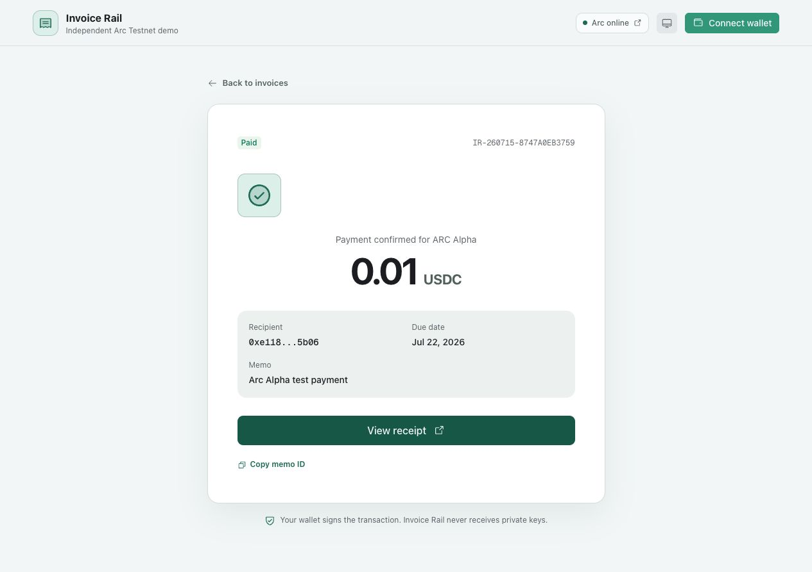
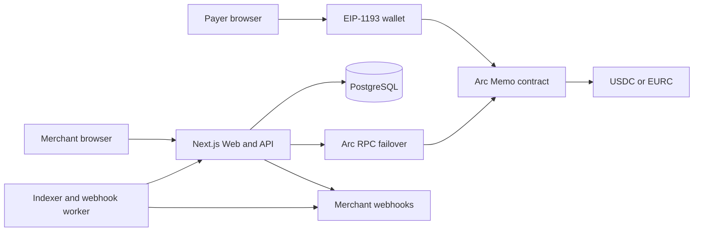

# Invoice Rail

**Stablecoin invoicing with verifiable onchain reconciliation on Arc.**

[Live app](https://invoice-rail-web.onrender.com) · [Verified Arc transaction](https://testnet.arcscan.app/tx/0x8c931d33318139415076fd52230d0a05cff2ebdc287ae964d10732d6980218c1) · [Demo video](docs/assets/invoice-rail-demo.mp4) · [Architecture](docs/ARCHITECTURE.md) · [Submission kit](docs/submission/INDEX.md)

Invoice Rail lets a merchant issue a USDC or EURC payment request, share a short payment link, and reconcile settlement from an Arc `Memo` event. The payer signs with their own wallet; Invoice Rail never receives private keys and does not custody funds.



## Production proof

| Item | Verified result |
| --- | --- |
| Public deployment | [invoice-rail-web.onrender.com](https://invoice-rail-web.onrender.com) |
| Live Arc payment | `0.01 USDC` for invoice `IR-260715-8747A0EB3759` |
| Transaction | [`0x8c93…18c1`](https://testnet.arcscan.app/tx/0x8c931d33318139415076fd52230d0a05cff2ebdc287ae964d10732d6980218c1) |
| Block | `51956775` |
| Explorer result | `Success`, confirmed within `<= 0.51s` |
| Testnet transaction fee | `0.002553726 USDC` |
| Reconciliation | Worker observed one Memo log and persisted one payment |
| Production data | Managed PostgreSQL 17 on Render |

These are testnet results, not production-volume or customer claims.

## The problem

Stablecoin transfers settle quickly, but finance teams still need to answer a slower operational question: **which invoice did this transfer pay?** Matching wallet addresses and amounts is fragile when payers reuse amounts, pay from a different wallet, or generate many transactions.

Invoice Rail binds the invoice reference and the token transfer in one Arc transaction. The same event can be indexed, verified, exported, and delivered to downstream systems.

## How it works

1. A merchant signs in with a wallet and creates an invoice.
2. Invoice Rail stores the invoice, its `memoId`, token address, and exact transfer calldata hash.
3. The merchant shares a random `/pay/<shareId>` link.
4. The payer signs `Memo.memo(token, transferData, memoId, memoData)` on Arc.
5. Arc executes the transfer and emits the Memo event atomically.
6. A background worker verifies the event and marks the invoice paid.
7. The app displays the receipt and can deliver a signed `invoice.paid` webhook.

## Architecture



The deployed topology uses one web service, one continuously running worker, and one private managed PostgreSQL database. Read traffic fails over across dRPC, Blockdaemon, and Circle RPC endpoints.

## Why Arc

- **USDC-native gas:** costs are denominated in the same unit finance teams already reconcile.
- **Deterministic fast finality:** paid status can become an operational fact without reorg handling.
- **Transaction memos:** the invoice reference and transfer remain part of one atomic transaction.
- **EVM compatibility:** existing wallets and TypeScript tooling work without a custom signing stack.
- **Stablecoin roadmap:** Arc provides a natural settlement layer for future cross-chain USDC collection.

## Implemented capabilities

- USDC and EURC invoices with strict amount, address, date, and memo validation
- Random server-side short payment links plus backwards-compatible legacy links
- Wallet challenge login with one-time challenges and `HttpOnly` sessions
- Owner, editor, and viewer workspace roles enforced on the server
- Exact Memo verification using `memoId`, token target, and calldata hash
- Persistent block cursor and idempotency by transaction hash plus log index
- Signed `invoice.paid` webhooks with an outbox and retry queue
- CSV export with spreadsheet-formula injection protection
- PGlite for local development and PostgreSQL for production
- Independent web and worker processes from one Docker image
- RPC fallback and actionable wallet guidance for provider rate limits
- Responsive light and dark UI

## Security model

- Private keys never leave the wallet.
- The application is non-custodial and never signs settlement transactions.
- Merchant identity comes from a consumed wallet-signature challenge, not an address supplied in JSON.
- Session tokens are only sent in `HttpOnly`, `SameSite=Lax` cookies; only hashes are stored.
- Stateful writes must match the configured application origin.
- Payment matching validates the official Memo contract, exact token target, memo ID, and transfer calldata hash.
- Webhook signatures cover `<timestamp>.<raw-body>` with HMAC-SHA256.
- Production database credentials and indexer secrets are injected by Render and are not committed.

This is an Alpha on Arc Testnet. It has not completed a third-party security audit and must not be used with real funds.

## Stack

- Next.js 16, React 19, TypeScript
- viem for wallet, contract, event, and receipt interactions
- PostgreSQL / PGlite
- Docker, Render Web Service, Render Background Worker
- Vitest, ESLint, GitHub Actions
- Remotion for the reproducible submission video

## Local development

Requirements: Node.js 22+ and pnpm.

```bash
pnpm install
cp .env.example .env.local
pnpm dev
```

Open [http://localhost:3000](http://localhost:3000).

Run the engineering checks:

```bash
pnpm check
pnpm test:auth
pnpm indexer -- --once
pnpm verify:invoice -- <invoice-id> <recipient> <amount> USDC
```

`pnpm check` runs the unit tests, ESLint, TypeScript checks, and the production build. `test:auth` uses temporary generated wallets and never reads a real private key.

## Production deployment

The repository includes `Dockerfile`, `compose.yaml`, and `render.yaml`. Production requires:

| Variable | Process | Purpose |
| --- | --- | --- |
| `APP_ORIGIN` | web | Exact HTTPS origin for signed login and origin checks |
| `DATABASE_URL` | web | Managed PostgreSQL connection string |
| `INDEXER_SECRET` | web + worker | Shared bearer secret for the background endpoint |
| `INVOICE_RAIL_APP_URL` | worker | Base URL of the web service |
| `NEXT_PUBLIC_ARC_RPC_URL` | build + web | Preferred Arc endpoint; the app keeps additional fallbacks |

Deployment and rollback details are in [docs/DEPLOYMENT.md](docs/DEPLOYMENT.md).

## Roadmap

1. Versioned migrations, monitoring, alerts, rate limits, and third-party security review.
2. Invitation acceptance, workspace naming, delivery history, and webhook replay.
3. Search, reporting, partial payments, overpayments, refunds, and accounting integrations.
4. Circle App Kit collection from other chains with Arc as the canonical settlement and reconciliation layer.
5. Pilot programs with agencies, exporters, and stablecoin-native platforms.

## Submission material

- [Project overview](docs/submission/PROJECT_OVERVIEW.md)
- [Architecture and technical design](docs/ARCHITECTURE.md)
- [Demo script and shot list](docs/submission/DEMO_SCRIPT.md)
- [Day One Architects application](docs/submission/ARCHITECTS_APPLICATION.md)
- [Arc Builders Fund / grant application](docs/submission/GRANT_APPLICATION.md)

## Official references

- [Arc transaction memos](https://docs.arc.io/arc/concepts/transaction-memos)
- [Send USDC with a transaction memo](https://docs.arc.io/arc/tutorials/send-usdc-with-transaction-memo)
- [Arc RPC endpoints](https://docs.arc.io/arc/references/rpc-endpoints)
- [Arc contract addresses](https://docs.arc.io/arc/references/contract-addresses)
- [Circle App Kit](https://docs.arc.io/app-kit)

Testnet USDC and EURC have no real-world value.
