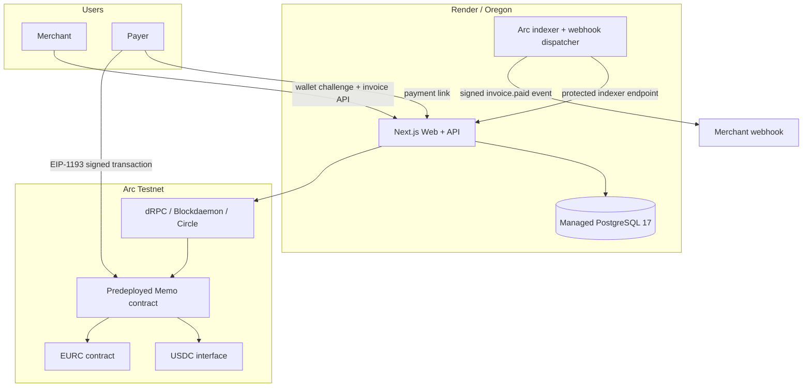
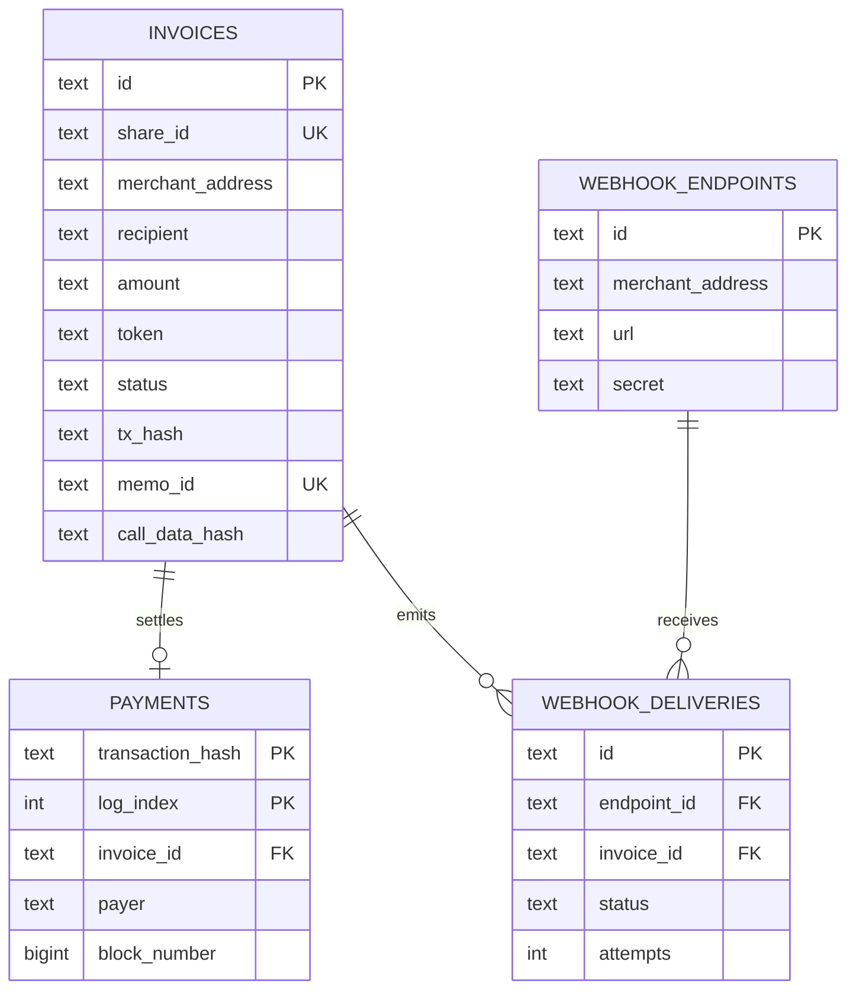

# Invoice Rail architecture

## Production status

Invoice Rail is running on Arc Testnet with a public Next.js application, an independent indexing and webhook worker, and managed PostgreSQL 17. Wallet-signed `0.01 USDC` and `0.01 EURC` payments have both reached the Paid state with successful ArcScan receipts; the USDC transaction was confirmed in block `51956775` within `<= 0.51s`.

## System context



The database is the application system of record. The Arc event is the settlement proof. Browser storage is only a migration and offline convenience layer.

## Payment and reconciliation sequence

```mermaid
sequenceDiagram
  participant M as Merchant
  participant A as Invoice Rail
  participant P as Payer wallet
  participant Arc as Arc Memo contract
  participant W as Indexer worker
  participant D as PostgreSQL

  M->>A: Sign wallet challenge
  M->>A: Create invoice
  A->>D: Store invoice + verification hashes
  A-->>M: Return /pay/shareId
  P->>A: Open payment link
  P->>Arc: memo(token, transferData, memoId, memoData)
  Arc-->>P: Finalized receipt
  W->>A: Run protected indexer cycle
  A->>Arc: Read Memo events from cursor
  A->>A: Verify memoId + token + calldata hash
  A->>D: Insert payment idempotently; mark invoice paid
  A-->>P: Display Paid + receipt
```

## Verification data

For every invoice, the server derives and stores:

```text
memoId       = keccak256(invoice.id)
transferData = ERC20.transfer(recipient, parseUnits(amount, 6))
callDataHash = keccak256(transferData)
memoData     = UTF8("invoice=<id>;note=<memo>")
```

The payer calls:

```text
Memo.memo(tokenAddress, transferData, memoId, memoData)
```

An event is accepted only when all of the following hold:

1. It was emitted by the official Arc Memo contract.
2. Its indexed `memoId` matches the invoice ID hash.
3. Its target is the configured contract for the invoice asset.
4. Its `callDataHash` matches the exact recipient and amount.
5. It includes a transaction hash and block number.
6. The transaction-hash and log-index pair has not been processed before.

The payer address is intentionally unrestricted so a third party can pay an invoice, while the recipient, token, and amount remain immutable.

## Data model



Additional tables hold the persistent index cursor, wallet challenges, hashed sessions, and workspace membership.

## Security boundaries

- Wallets sign locally; the application cannot access private keys.
- A one-time five-minute challenge establishes merchant identity.
- Challenge reuse is rejected and session tokens are stored only as hashes.
- Stateful writes require the configured HTTPS origin.
- Workspace permissions are recomputed server-side for every request.
- Payment links contain random 128-bit identifiers and no credentials.
- URL data, token symbols, EVM addresses, amounts, dates, and memo lengths are validated.
- Webhook secrets are displayed once; deliveries are HMAC-signed and retried from an outbox.
- Production database access is private and credentials are injected as secrets.
- The public client uses ordered RPC failover; wallets receive an actionable remediation for provider rate limits.

## Reliability and operations

- The indexer persists its next block so restarts resume rather than rescan from genesis.
- Arc queries stay below the RPC 10,000-block range limit.
- Payment insertion is idempotent on transaction hash plus log index.
- Webhook delivery is idempotent per endpoint, event type, and invoice.
- `/api/health` verifies database initialization and connectivity.
- Ordered migrations record version, name, checksum, and application time, and fail closed on drift.
- Database-backed fixed-window rate limits protect authentication and state-changing APIs across instances.
- Structured JSON logs carry request IDs and redact credential-shaped fields.
- `/api/metrics` exposes protected schema, invoice, webhook, cursor, and persistent worker-heartbeat metrics.
- Critical migration, Indexer, webhook-backlog, and database-latency alerts make readiness fail closed.
- GitHub Actions runs tests, lint, and the production build before merge.
- Render runs separate web and worker instances from the same immutable Docker build.

## Current limits

- The Alpha has not completed a third-party security audit.
- USDC and EURC each have one verified wallet-signed testnet payment; broader wallet compatibility still needs regression coverage.
- Workspaces are address-based and do not yet include invitation acceptance or organization profiles.
- Search, accounting integrations, partial payments, overpayments, refunds, and webhook replay UI are not implemented.
- Public RPC fallback improves availability but does not replace a dedicated production RPC agreement.
- The Memo payment flow currently targets EOA wallets; smart-account support depends on Arc Memo compatibility.

## Next architecture milestones

1. Expand USDC/EURC regression across multiple wallets and complete an external security review; ordered migrations, logs, metrics, alert rules, and API limits are implemented.
2. Refund and exception state machine with immutable audit history.
3. Webhook delivery console and dead-letter replay.
4. Circle App Kit source-chain routing while retaining Arc as the canonical reconciliation layer.
5. SDK and accounting adapters for platform integrations.
